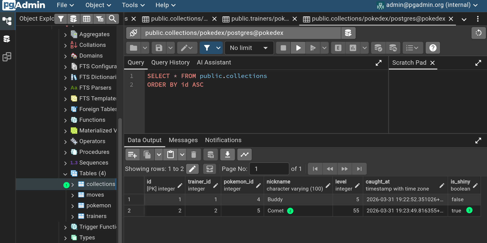

# Advanced Pokedex Database Lab: Beyond the Basics

Welcome, Trainer! You've learned the basics of catching Pokemon. Now, it's time to master the **CRUD** cycle—the four basic operations of every database—and then look under the hood at how the database actually works.

> [!TIP]
> **Toggling SQL Logs:** As you work on advanced missions, the terminal can get noisy with SQL output. You can toggle this behavior at any time:
> - `python main.py db logs --off` to clean up the screen.
> - `python main.py db logs --on` to see the raw SQL commands again.

---

## Phase 1: The Full CRUD Cycle

**CRUD** stands for **C**reate, **R**ead, **U**pdate, and **D**elete. In this phase, you will perform the full cycle twice: once in the Web GUI and once in the CLI.

### 🕵️ Mission 1.1: CRUD in *mostly* the Web GUI
0.  Connect to the docker container's terminal using: `docker exec -it pokedex_app bash` and start the database, if needed: `python main.py db init && python main.py db seed`
1.  **Create:** Use the CLI command `python main.py trainer add` to create a trainer for yourself (if youdon't have one from the previous section). Then use `python main.py catch` to catch a Pokemon.
2.  **Read:** Open the Web UI ([http://localhost:5000/trainers](http://localhost:5000/trainers)), find your profile, and click it to see your new team member.
3.  **Update:** Click the **"Level Up!"** button on your Pokemon's card. Watch the level increase!
4.  **Delete:** Click the **"Release"** button. Confirm the choice and watch the Pokemon return to the wild.

### ⚡ Mission 1.2: CRUD in the CLI
Now, perform the same steps using only the terminal:

0.  Connect to the docker container's terminal using: `docker exec -it pokedex_app bash` (..if you diconnected)
1.  **Create:** `python main.py catch <your_id> <pokemon_id> --nickname "CLI-Buddy"`
2.  **Read:** `python main.py trainer team <your_id>`
3.  **Update:** `python main.py trainer level-up <collection_id>`
4.  **Delete:** `python main.py trainer release <collection_id>`

---

## Phase 2: Manual SQL Queries

Up until now, our Python code has been writing SQL for you. Now, you're going to use the `lab query` command to run your own **raw SQL**.

### How to run a query:
```bash
python main.py lab query "SELECT * FROM pokemon;"
```

### 🕵️ Mission 2.1: The Scout
Find all Pokemon in the Pokedex that are of the **'Fire'** type.
*   **Hint:** `SELECT * FROM pokemon WHERE type1 = 'Fire';`

### ⚡ Mission 2.2: The Power Trip
List only the **names** of Pokemon that have an **attack higher than 30**, ordered from strongest to weakest.
*   **Hint:** `SELECT name FROM pokemon WHERE attack > 30 ORDER BY attack DESC;`

### 🤝 Mission 2.3: The Detective (The JOIN)
List every trainer's name alongside the nickname of the Pokemon they've caught.
*   **Hint:** 
    ```sql
    SELECT trainers.name, collections.nickname, collections.level 
    FROM trainers 
    JOIN collections ON trainers.id = collections.trainer_id;
    ```
Using this skill: 
- Can you NOT show the level of the pokemon in the table? 
- How about the species (from the `pokemon` table)?

---

## Phase 2.5: The Security Gap (SQL Injection) 🛡️

Now that you've seen how to write manual SQL queries, you might wonder: "What happens if a user provides the data for my query?" 

In most applications, a user's input (like a search term) is "pasted" into a SQL query. If that code is written poorly, a malicious user can "break out" of the search and run their own commands. This is called **SQL Injection**.

### 🕵️ Mission 2.4: The Breach
Open the **Security Lab** in the Web UI ([http://localhost:5000/search](http://localhost:5000/search)).

#### Experiment 1: Bypassing the Rules
1.  Select **NOT SECURED** mode.
2.  Type `' OR '1'='1` in the search box.
3.  **What happened?** Look at the *Executed SQL Statement*. You'll see: `WHERE name = '' OR '1'='1'`. 
    *   Because `'1'='1'` is always true, the database returns **every single Pokemon**, even though you didn't search for them! In a real app, this is how attackers bypass login screens without a password.

#### Experiment 2: The Data Leak (UNION)
1.  Select **NOT SECURED** mode.
2.  Type `' UNION SELECT id, name, hometown, '...', 0, 0, 0, 0, created_at FROM trainers --`
3.  **What happened?** You just "glued" the results of the `trainers` table onto the `pokemon` table! 
    *   The `--` at the end tells the database to "ignore" the rest of the original query (the closing quote). 
    *   Suddenly, your "Pokemon Search" is leaking private trainer data.
    *   Try this again, but [prepend](https://dictionary.cambridge.org/us/dictionary/english/prepend) the string above with the name of a pokemon to see a table mixed with trainer and pokemon data.

#### Experiment 3: The "Drop Table" (Destructive)
1.  Select **NOT SECURED** mode.
2.  Type `'; DROP TABLE collections; --`
3.  **What happened?** (Don't worry, we've protected this lab from actually deleting tables, but in a real app...)
    *   The semicolon `;` tells the database "This command is finished, now start a NEW one."
    *   The database would then try to run `DROP TABLE collections`, deleting everyone's caught Pokemon!

---

### 🧠 How to stop the "Injection"
The secret is **Parameter Binding** (the **SECURED** mode).

When you use the **SECURED** mode, the application sends a template to the database first:
`SELECT * FROM pokemon WHERE name = :name`

The database "pre-compiles" this command. Then, we send your input (e.g., `' OR '1'='1`) as a separate piece of **data only**. 

The database treats your input as a literal string. It doesn't try to "run" it. It just looks for a Pokemon whose name is exactly the string `' OR '1'='1`. Since no such Pokemon exists, the attack fails, and your database stays safe.

**The Golden Rule:** Never use f-strings or `+` to build SQL queries with user input. Always use parameter binding!    ...Little Bobby Tables:


---

## Phase 3: Schema Evolution (Migrations)

Databases grow as your application's needs change. In this phase, we will "evolve" our schema by adding a new column and a new table. This can be a trick part of database management, becuase you will likely want to change the database without deleting any of the data within it. 

Just like it is commonly done by professionals, we will be using a script to manage the database migration (*migrations are rarely done 'by hand' since there can be a lot to manage*). This migration will have two changes to the database:

1. Adding an Attribute (`is_shiny`) as a column to the `collections` table.
   - We want to track if a specific caught Pokemon is a rare "Shiny" version. We'll add this to the `collections` table.

2. Adding a New Table: `moves`, to describe moves known by each pokemon.
   - We'll create a `moves` table. This is a **One-to-Many** relationship: One Pokemon species can have **many** different moves.
   - This lesson doesn't explore adding moves to the pokemon (*beyond adding the table*) but that is a great extension for anyone who is interested in learning more and testing their understanding.

### 🛠️ Lab Activity: Run the Migration
Run the following command to update your database live - [read the code for how it works](https://github.com/RiceC-at-MasonHS/postgres_example_db/blob/2ceda50eeb26f136476335e80c420f4092725e90/src/cli.py#L180):
```bash
# Connect to the docker container ...if you diconnected: 
docker exec -it pokedex_app bash

# This script handles the migration details
python main.py db migrate
```

### 🧪 Mission 3.1: Verify the Evolution
Use your `lab query` tool to see if the new column exists:
```bash
python main.py lab query "SELECT id, nickname, is_shiny FROM collections;"
```
You should also be able to see the `is_shiny` column added in PGAdmin4: the `collections` table. 

### 🧪 Mission 3.2: Toggling Shiny Status
Now that the database has a `is_shiny` column, let's learn how to update specific rows in two different ways!

First, you're going to need the `collection_id` of a trainer's pokemon, to make that individual pokemon into a shiny version.
```bash
# Find a collection_id from your team list first!
python main.py trainer team <trainer_id>
```

  - **Option A: The Python CLI way**
We've added a command specifically for this:
```bash
# actually set the pokemon to be shiny
python main.py trainer shiny <collection_id> --on
```

  - **Option B: The Raw SQL way**
Try to do the exact same thing using only the database `lab query` tool:
```bash
python main.py lab query "UPDATE collections SET is_shiny = TRUE WHERE id = <collection_id>;"
```
*Tip: After running either command, refresh the Web UI! You should see a "💫 Shiny" badge appear on your Pokemon's card.*

---

## Phase 4: Data Integrity (The Rules)

A good database protects its data using **Constraints**. Those constraints help protect data **integrity** and reduce the available space for errant or malicious data to be entered into the database. 

### 🛠️ Lab Activity: Secure the Database
Run the following command to add rules to your tables:
```bash
# Connect to the docker container ...if you diconnected: 
docker exec -it pokedex_app bash

# Add rules to your database
python main.py db secure
```

### 🧪 Mission 4.1: Try to Break the Database
Try to run these "illegal" commands and see the database refuse them:

**Attempt A: The Duplicate Trainer**
Try to add a trainer with a name that already exists.
```bash
python main.py trainer add
```

**Attempt B: The Impossible Level**
Try to set a Pokemon's level to 999.
```bash
python main.py lab query "UPDATE collections SET level = 999 WHERE id = 2;"
# we made an assumption for the <collection_id> above, you may need to change it
```
> [!TIP] 
> If you are in Rice's class, You can turn in a screenshot at this point. 
>
> Right-click on the `collections` table, and `View/Edit Data` then `All Rows`.
>
> [Alternate]: Left-click on the `collections` table, then `ALT + SHIFT + V`.
>
> Your screenshot should show:
>    - (1) the contents of the `collections` table
>    - (2) your own name, as the name of a Pokemon (shown as "Comet")
>    - (3) a pokemon where the `is_shiny` column has a value of `true`
>
> See the example screenshot below, for reference. 
> The only difference, is that **your screenshot should be FULL DESKTOP**.




---

## Phase 5: Automated Testing

Professional developers don't just test things by hand; they write scripts to do it for them. We've created a suite of **Advanced Tests** that verify everything you've learned in this lab.

### 🧪 Mission 5.1: Run the Advanced Tests
Run the following command to see if your database passes all the missions:

```bash
docker compose run --rm app pytest tests/test_advanced.py
```

These tests will:
1.  Verify your **Update** and **Delete** logic.
2.  Test that your **Schema Migration** (adding columns and tables) works.
3.  Confirm that your **Data Integrity** rules (Constraints) are correctly blocking bad data.
